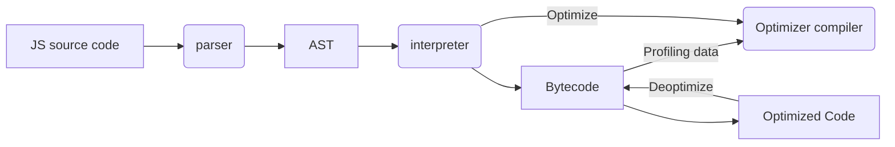

# JAVASCRIPT PROFESSIONAL COURSE
**By:** Richard Kaufman [Platzi](https://platzi.com/p/richard/)

## Content
- [Fundamentals](#basic-fundamentals)
    - [Scope](#scope)
    - [Closures](#closures)
    - [This](#this)
    - [Call, Apply and Bind](#call-apply-and-bind)
    - [Prototype](#prototype)
    - [Prototypal inheritance](#prototypal-inheritance)
- [JavaScript Operation](#javascript-operation)
    - [Parsers, Abstract Syntax Tree](#parsers-abstract-syntax-tree)
    - [JavaScript Engine](#javascript-engine)
    - [Event Loop](#event-loop)
- [Intermediate Fundamentals](#intermediate-fundamentals)
    - [Promises](#promises)
    - [Getters and Setters](#getters-and-setters)
- [Advanced Fundamentals](#advanced-fundamentals)
    - [Proxy](#proxy)   
    - [Generators](#generators)
- [DOM APIs](#dom-apis)
    - [Fetch](#fetch)
    - [IntersectionObserver](#intersectionObserver)
    - [Visibility Change](#visibility-change)
    - [Service Workers](#service-workers)
- [TypeScript](#typescript)
    - [Introduction](#introduction)
    - [Basics](#basics)
    - [Interfaces](#interfaces)
    - [Classes](#classes)
- [Design Patterns](#design-patterns)
    - [Categories](#categories)
    - [Singleton Pattern](#singleton-pattern)
    - [Observer Pattern](#observer-pattern)
    - [Redux](#redux)
    - [Decorator Pattern](#decorator-pattern)


## Basic Fundamentals
**DOM** is the browser's representation of a HTML file. The browser read and interprets the file and when completes shoot the event *DOMContentLoaded*, which means that the entire document is available to be manipulated.

Every script that we load on our page has a call and an execution.

We can make asynchronous calls with:
- *async:* We can make an asynchronus request without stop the the DOM loading until the code is executed.
- *defer:* We can make an asynchronus request until the end of the entire document being loaded.

- NOTE: Is recommended add the scripts just before closing the body so that whole document is available.

### Scope
The **Scope** defines the lifetime of a variable and where we can use it. We define four types:

- The **Global Scope** defines all the variables *var* available for all scripts loaded in the page, they are declared outside a function or block. Is so risky manipulate this type of scope because we can overwrite variables.
- The **Function Scope** defines all variables within a function using *var* only visible within itself (including the arguments passed to the function).
- The **Block Scope** defines all variables within a block (loops), *let* and *const* are used for this type.
- The **Module Scope** defines all variables within a module using the attribute `type="module"`.

### Closures
El Scope plus a function generates **Closures**, they are functions that returns a function or an object with functionalities that keep the variables that were declared outside their scope.

The Closures help us to have something similar to private variables (feature not included in JavaScript by default), they encapsulate variables that cannot be modified directly vy other objects, only by functions belonging it.

### This
**This** refers to an Object, this object is currently executing a piece of code.

*This* can't be called directly y for that reason that we can use depends in the container that is called:
- When we call *this* in the Global Scope or the Function Scope refers to the object **Window**, at least when we are not running in *strict mode*, in that case will return *undefined*. 
- When we call *this* from a function inside an object, *this* refers to that object.
- When we call *this* from a class, *this* refers to the instance generated by the constructor.

```JavaScript
// In the Global Scope
console.log(`this: ${this}`); // => this: [object window]

const whoIsThis = () => {
    return this
}
console.log(`whoIsThis: ${whoIsThis()}`); // => whoIsThis: [object window]

// In strict mode
'use strict'
console.log(`whoIsThis: ${whoIsThis()}`); // => whoIsThis: undefined


// From a function inside and object
const person = {
    name: 'Daniel',
    greet: () => {
        console.log(`Hi, i am ${this.name}`)
    }
}
person.greet(); // => Hi, i am Daniel

const action = person.saludar;
action() // => Hi, i am

// From a class
 class Person{
    constructor(name) {
        this.name = name;
    }

    greet(){
        console.log(`Hi, i am ${this.name}`)
    }
}

const daniel = new Person('daniel')
daniel.greet(); // => Hi, i am daniel
```

### Call, Apply and Bind
This functions help us to set a value to *this*, that means change the context when we use a call to a function:
- functionName.call(): Executes the function getting *this* as the first argument and then the function called.
- functionName.apply(): Executes the function getting *this* as the first argument, and then an array with the arguments received for the function called.
- functionName.bind(): Get *this* as the first and unique argument, do not execute the function, and returns another function with the new this integrated. Bind allows use `currying`, this is the possibility of call a function with less parameters than it expects, this returns a function which expect the remaining parameters and then returns the result.

```JS
// Call
function greet() {
    console.log(`Hi, i am ${this.firstName} ${this.lastName}`);
}

const daniel = {
    firstName: 'Daniel',
    lastName: 'Caamal'
}

greet.call(daniel);

function walk(meters, direction) {
    console.log(`${this.firstName} walks ${meters} meters to ${direction}`);
}

walk.call(daniel, 400, 'west')

// Apply
walk.apply(daniel, [800, 'east'])

// Bind
const israel = {
    firstName: 'Israel',
    lastName: 'Sánchez'
}
const greatIsrael = greet.bind(israel);
greatIsrael();

// Currying
const walkIsrael = walk.bind(israel, 1000, 'north');
walkIsrael();
```

### Prototype
In JavaScript everything is a Object, it do not have class.

All Objects inherit from a prototype which inherit from another prototype, and the chain continues, this is called the **Prototype chain**.

The keyword *new* created a new object that inherit all the properties contained in the other object.

### Prototypal Inheritance
By default the Object in JavaScript has as prototype **Object**, this is the starting point of all objects, this is the parent prototype, for that Object has as parent prototype *undefined*.

When we call a function or a variable not included in the same object that called it is called, the entire prototype chain is searched until it is found, if it was not found it returns *undefined*.

The function **hasOwnProperty** help us to verify if a property is part of an Object, or if inherited from a prototype chain.

<div align="right">
  <small><a href="#content">🡡 return</a></small>
</div>

## JavaScript Operation

### Parsers, Abstract Syntax Tree
The JS Engine receive source code and process it in this way:
1. The **parser** decomposes and creates tokens and integrate the **AST (Abstract Syntax Tree)**.
2. This is compiled to bytecode and then is executed.
3. What can be optimized from base code to machine code is replaced.

A **SyntaxError** is thrown when the JS Engine find parts outside from the language's syntax, this is made because an AST is actually generated by the parser.

The parser is 15% - 20% part of the execution process, so we have tu use the code's parser just when we need it and not before knowing if it is going to be used or not.

### JavaScript Engine



The **AST** is a network that represents a program. Is used in:
- Babel
- V8 Engine

**Bytecode vs Machine Code**
- Bytecode:
    - Is like assembly.
    - Portable.
    - Runs by a virtual machine
- Machine Code
    - Binary
    - Specific instructions target to one architecture or processor.

The **profiling** take notes from bytecode y look up for statements repeated to make optimizations:
- *Hot* in V8 terms means that one part of code is ready to be optimized.
- When the function receives different parameters the optimization is removed and again is passed to bytecode.

### Event Loop
**Call Stack** is a list of all the function that are actually called.

**Memory Heap** save information about variables, scopes and others.

In the **event loop** the functions are passed to into the **call stack** when they are called (*push*), and they are taken out when they return a value (*pop*). The event loop defines two queues:
- Task Queues: Tasks schedule for all functions.
- Micro Task Queues: Important task, they are executed first in the event loop (Like Promises).

<div align="right">
  <small><a href="#content">🡡 return</a></small>
</div>

## Intermediate Fundamentals

### Promises

### Getters and Setters

<div align="right">
  <small><a href="#content">🡡 return</a></small>
</div>

## Advanced Fundamentals

### Proxy

### Generators

<div align="right">
  <small><a href="#content">🡡 return</a></small>
</div>

## DOM APIs 

### Fetch

### IntersectionObserver

### Visibility Change

### Service Workers

<div align="right">
  <small><a href="#content">🡡 return</a></small>
</div>

## TypeScript

### Introduction

### Basics

### Functions

### Interfaces

### Classes

<div align="right">
  <small><a href="#content">🡡 return</a></small>
</div>

## Design Patterns

### Categories

### Singleton Pattern

### Observer Pattern

#### Redux

### Decorator Pattern

<div align="right">
  <small><a href="#content">🡡 return</a></small>
</div>


